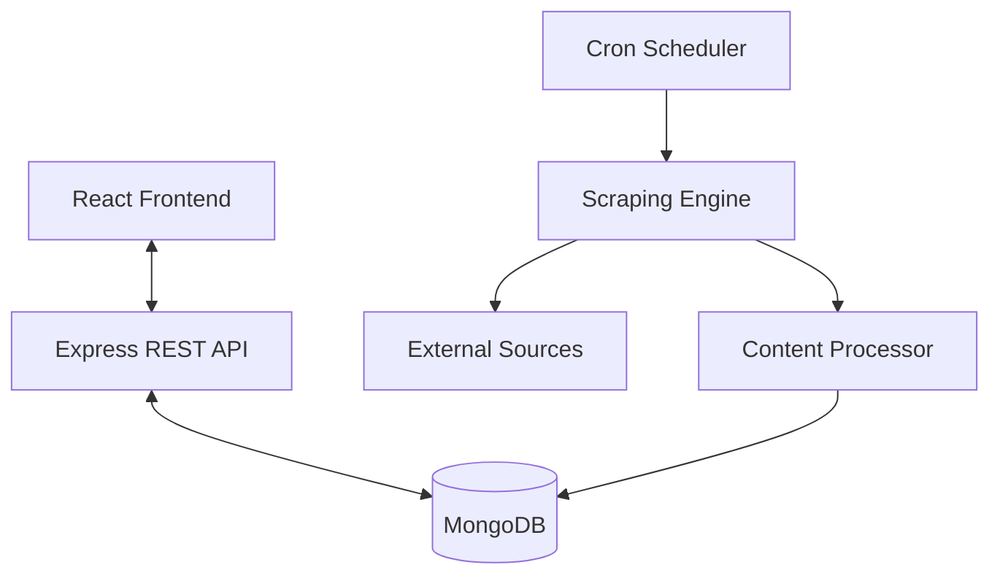

# Echoless Tech News Aggregator

> **A scalable, real-time technology news platform powered by a custom scraping engine and a modern social frontend.**

[](https://mongodb.com)
[](https://opensource.org/licenses/MIT)

## 📖 Overview

**Echoless** is not just a news aggregator; it's an intelligent platform designed to curate, deduplicate, and categorize technology news from the world's leading sources (TechCrunch, The Verge, Hacker News, Dev.to) in real-time.

The system is built with a focus on **Clean Architecture**, **Scalability**, and **Developer Experience**. It features a self-healing scraping engine, an intelligent content processor for uniqueness, and a social layer for community engagement.

---

## 🏗 Architecture

The project follows a **Monorepo** structure separating concerns between the API and the Client.



### 1. Backend (`/server`)
Built with **Node.js** and **Express**, following a service-oriented architecture.
-   **Core**: Express.js with ES Modules.
-   **Database**: MongoDB (Mongoose ODM).
-   **Scrapers**: Cheerio (Static) + Puppeteer (Dynamic).
-   **Scheduling**: node-cron for hourly updates.
-   **Auth**: JWT-based stateless authentication.

### 2. Frontend (`/client`)
Built with **React 18** and **Vite** for performance.
-   **Styling**: TailwindCSS for a modern "Midnight Pro" aesthetic.
-   **State**: TanStack Query (Server State) + Context API (Client State).
-   **Routing**: React Router v6.

---

## 🚀 Getting Started

### Prerequisites
-   Node.js v18+
-   MongoDB (Local or Atlas URI)
-   npm or yarn

### Installation

1.  **Clone the repository**
    ```bash
    git clone https://github.com/your-username/echoless-tech.git
    cd echoless-tech
    ```

2.  **Setup the Backend**
    ```bash
    cd server
    npm install
    # Create .env file
    cp .env.example .env
    # Start Development Server
    npm run dev
    ```

3.  **Setup the Frontend**
    ```bash
    cd ../client
    npm install
    npm run dev
    ```

---

## 🔍 Key Features

### Agnostic Scraping Engine
The scraping logic is decoupled from the core application. Each source is implemented as a strategy pattern, allowing easy addition of new sources without modifying the core engine.

-   **Duplicate Detection**: Uses a multi-stage verification process (URL normalization + Title fuzzy matching) to ensure zero duplicates.
-   **Auto-Categorization**: An intelligent keyword mapping system tags articles automatically during the ingestion process.

### Real-time Automation
The system runs a cron job `0 * * * *` (Top of every hour) to fetch fresh content.

---

## 👨‍💻 Contributing

We enforce high standards for code quality.
-   **Commits**: Follow Conventional Commits.
-   **Documentation**: All complex logic must be documented with JSDoc.
-   **Linting**: Run `npm run lint` before pushing.

---

## 📜 License

This project is open-sourced under the MIT License.
